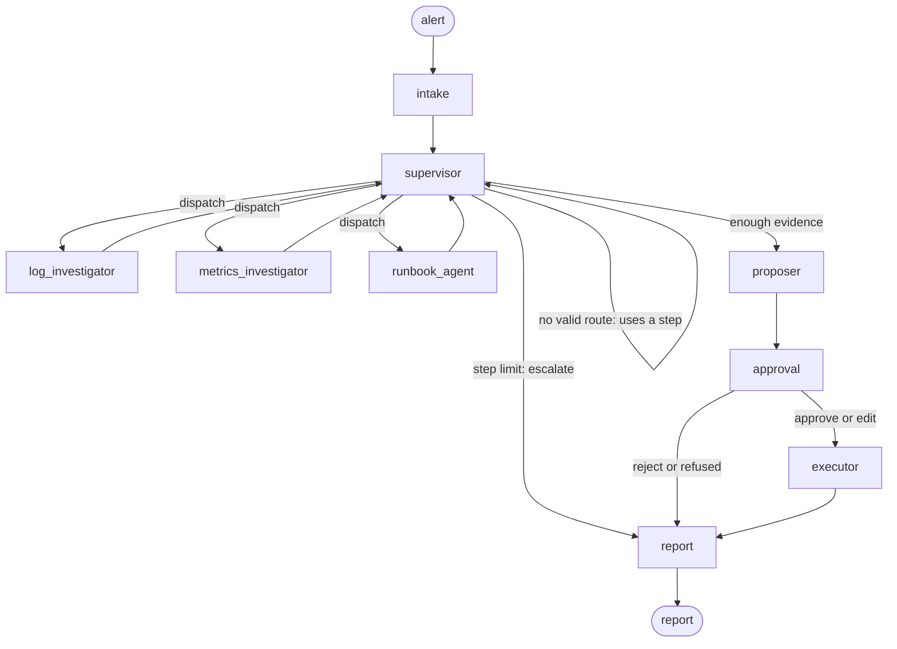

# triage-graph

A multi-agent incident-triage system built on [LangGraph](https://docs.langchain.com/oss/python/langgraph/),
with a smaller [CrewAI](https://docs.crewai.com/) port of the same workflow for comparison.

An alert comes in. A supervisor sends specialists to look at logs, metrics and
runbooks, then a proposer picks one action from a fixed allow-list. The run then
**pauses until a human approves, edits or rejects the proposal**. Only after that does
an executor act, and even then it only records what it would do. The run ends with a
markdown report of the evidence each specialist found.

**This is a portfolio project.** It runs against four synthetic incidents in
`fixtures/`, acts on a dry-run infrastructure adapter, and has never been used on a
real incident. Everything runs offline on a deterministic fake model. A real model
(Anthropic by default) can be switched on with an environment variable, but no
real-model run is included here. See [Limitations](#limitations).

## Quickstart (no API key)

You need [uv](https://docs.astral.sh/uv/).

```sh
git clone <this repo> triage-graph && cd triage-graph
uv sync
uv run triage run --alert fixtures/alerts/high-latency.json --thread-id demo
uv run triage resume demo --approve
```

The first command streams the investigation as it happens and stops at the approval
gate:

```text
intake               ALERT-1042 [high] checkout-api: checkout-api p99 latency above 1s
supervisor           step 1/6 -> log_investigator: errors and warnings around the alert, and recent changes
log_investigator     search_logs(start='2026-09-14T09:30:00Z', end='2026-09-14T10:35:00Z', min_level='WARN')
...
proposer             proposes scale_up on checkout-api (proposal 5f0c1d2e9a41)
approval             paused: waiting for a human decision

=== Waiting for approval (thread demo) ===
```

The second command is a separate process. It resumes from the SQLite checkpoint in
`.triage/`, runs the approved action against the dry-run adapter, and writes the
report to `.triage/reports/demo.md`. Try `--reject --reason "..."` or
`--edit restart_service` instead, or run with `--wait` to decide in the same terminal.
`uv run triage show demo` prints a pending proposal or a finished report.

The four scenarios:

| Alert | What is going on | Expected action |
|---|---|---|
| `high-latency.json` | Traffic surge saturates CPU; the autoscaler is already at its ceiling | `scale_up` |
| `error-spike-after-deploy.json` | 5xx rate jumps one minute after a release | `rollback_deploy` |
| `memory-leak.json` | A cache that never evicts, ending in `OutOfMemoryError` | `restart_service` |
| `intermittent-5xx.json` | Bursts that line up with two failing dependencies and a flag change | `page_human` |

## How it works



- **Supervisor**: calls the model with a `route` tool and dispatches one specialist
  at a time. Every turn that doesn't end the investigation uses a step. At
  `max_steps` (default 6) the run stops with "insufficient evidence, escalating".
- **Specialists**: each is its own small LangGraph subgraph, a model node plus a
  `ToolNode`, with private message history. The tools
  ([`tools.py`](src/triage_graph/tools.py)) read the fixture logs and metrics and do
  lexical search over `runbooks/*.md`.
- **Proposer**: returns a diagnosis and one action. Code checks it: an action off the
  allow-list, or aimed at another service, is replaced by `page_human`, and the
  refused action is recorded.
- **Approval**: `interrupt()`. The run is checkpointed to SQLite and the process can
  exit. `triage resume` sends the decision with `Command(resume=...)` from any later
  process.
- **Executor**: re-checks everything, then calls the dry-run adapter, which appends to
  a JSON-lines ledger and never changes anything.
- **Report**: built by code from the state, not written by a model.

The CLI streams `stream_mode=["updates", "custom"]` with `subgraphs=True`, so tool calls
made inside the specialists show up as they happen.

### The approval boundary is code, not prompt

The allow-list lives in [`actions.py`](src/triage_graph/actions.py) and is enforced
at several points:

- The graph's input schema only accepts the alert, so a caller can't pre-seed an
  approval.
- The proposer replaces an off-list or out-of-scope action with `page_human`.
- The approval node fails closed. The decision must be well-formed, must name the
  pending proposal's id, and an edit must stay on the allow-list.
- The executor re-validates the decision, the proposal id, the allow-list and the
  target before acting.
- The adapter only has methods for the four allowed actions, and records each
  proposal at most once.

[`tests/test_approval.py`](tests/test_approval.py) covers each layer.
[`tests/test_crash_resume.py`](tests/test_crash_resume.py) SIGKILLs `triage run --wait`
while it waits for a decision, resumes it with `triage resume` in a new process, and
checks that the investigation was not re-run.

## Using a real model

```sh
uv sync --extra anthropic
export ANTHROPIC_API_KEY=...
TRIAGE_PROVIDER=anthropic uv run triage run --alert fixtures/alerts/memory-leak.json
```

`TRIAGE_MODEL` changes the model (default `claude-opus-5-5`) and `TRIAGE_EFFORT` sets
the reasoning effort. This path was written against the `langchain-anthropic` docs and
source but **never run**: no API key was available while it was built.

## Evals

```sh
uv run python -m evals.run                          # fake model, writes evals/results/fake.md
TRIAGE_PROVIDER=anthropic uv run python -m evals.run  # real model: shows the plan and cost, asks first
```

Each scenario runs N times in two variants: with the runbooks' "Suggested action"
lines, and with them hidden from every agent. The report shows, per variant, how
often the proposed action matched the expected one, flags any scenario whose runs
disagreed, and averages steps and tokens.

- **Fake model.** The eval runs as part of the test suite. Its 100% is by construction,
  and the report says so: [evals/results/fake.md](evals/results/fake.md).
- **Real model.** The script prints its plan and estimated cost, asks before spending
  anything, and caps spend at $2 by default. A callback refuses any model call whose
  worst case could cross the cap. At list prices, $2 covers about one run per cell on
  `claude-opus-5-5` (low effort only) and about six on `claude-haiku-4-5`; see
  [DECISIONS.md](docs/DECISIONS.md#cost-control-for-real-model-runs). No real-model
  results are committed.

## The CrewAI port

```sh
uv sync --extra crewai
uv run python -m crewai_port --alert fixtures/alerts/error-spike-after-deploy.json
```

[`crewai_port/`](crewai_port/) rebuilds the investigation and proposal (steps 1 to 6)
as a CrewAI crew. It uses the same fixtures, tools, prompts and allow-list check. On
the fake models it proposes the same action as the LangGraph version for every
scenario. Two experiments test how CrewAI pauses for approval and resumes after a
crash.

[docs/LANGGRAPH_VS_CREWAI.md](docs/LANGGRAPH_VS_CREWAI.md) covers what each framework
made easy, what it hid, and where it needed working around, all from building this.

## Development

```sh
uv sync --all-extras
uv run pytest                                   # offline; the paid eval test skips itself
uv run ruff check . && uv run ruff format --check .
```

CI runs lint, the tests and the quickstart on Ubuntu and macOS with Python 3.11,
3.12 and 3.13. It uses no secrets.

```text
src/triage_graph/   graph, nodes, tools, fake model, CLI
crewai_port/        CrewAI version of steps 1-6, plus experiments
evals/              eval harness and reports
fixtures/           alerts, generated logs and metrics, expected answers
runbooks/           markdown runbooks the runbook agent searches
docs/               DECISIONS.md, LANGGRAPH_VS_CREWAI.md, upstream bug write-up
scripts/            fixture generator (seeded, reproducible)
```

[docs/DECISIONS.md](docs/DECISIONS.md) records which doc pages and versions this was
built against, and where the docs and the installed source disagreed. For example,
LangGraph's default recursion limit is documented as 1000 but is 10007.

## Limitations

- **Actions only ever target the alerting service.** Neither the model nor a human
  editing a proposal can act on another service. A proposal to restart a failing
  dependency is refused and becomes `page_human`, and an edit changes the action
  only. This keeps the blast radius small, but it means a correct fix that belongs
  to another service always needs a person.
- **The approval gate trusts the checkpoint database.** Anyone who can write to the
  SQLite file can forge a decision. Decisions are not signed.
- **The fake model is written against the fixtures.** Its keyword rules exercise the
  graph; they say nothing about how an LLM would triage.
- **No real-model results.** The Anthropic path and the real-model eval have never
  run.
- **The data is synthetic.** Four scenarios, one service each. Logs and metrics come
  from a seeded generator, and the tools read files, not real backends.
- **Runbook search is lexical (TF-IDF).** Without the service filter, the ambiguous
  scenario's runbook only narrowly beats an unrelated one.
- **The runbooks name the answer.** Each scenario's runbook section suggests the
  expected action. The eval's "suggestions hidden" variant removes that line, but the
  surrounding prose still describes the fix.
- **Execution is a dry run.** The adapter records intent; nothing is restarted,
  scaled or rolled back.
- **Single user, local.** A CLI over a local SQLite file, with no authentication and
  no protection against two people resuming the same run at once. The ledger does
  refuse to record the same proposal twice.
- **The CrewAI port** covers steps 1 to 6 only. Importing CrewAI and running a crew
  write files under your user data directory (`~/Library/Application Support` on
  macOS), and its telemetry is on unless disabled. `crewai_port` turns it off.

## License

MIT. See [LICENSE](LICENSE).
